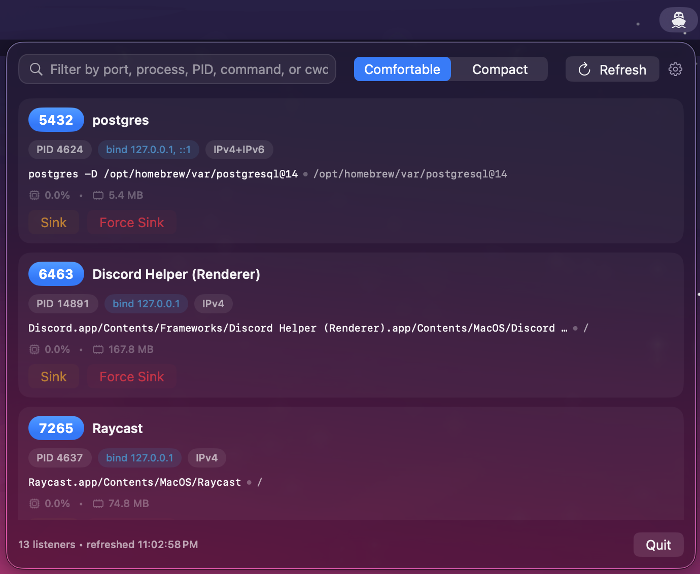
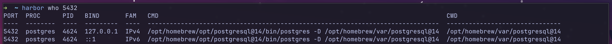
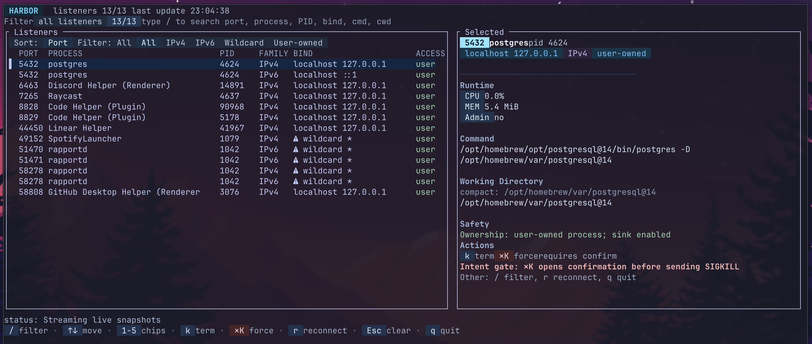

# Harbor

Harbor is a local listening-port monitor for macOS. The repo is split into a shared Swift core, a Swift CLI, a SwiftUI app target, and a Go TUI module.

## Screenshots

### Menubar app



### CLI



### TUI



## Install

Install from the first-party Homebrew tap:

```sh
brew tap VishalBilagi/tap
brew install VishalBilagi/tap/harbor
brew install VishalBilagi/tap/harbor-tui
brew install --cask VishalBilagi/tap/harbor-app
```

Direct release assets are published on GitHub Releases if you need a manual fallback:

- CLI + TUI archives: [GitHub Releases](https://github.com/VishalBilagi/harbor/releases)
- macOS app archive: [GitHub Releases](https://github.com/VishalBilagi/harbor/releases)

Basic validation after install:

```sh
harbor version
harbor-tui --version
open -a Harbor
```

Current packaging note:

- The menubar app is currently distributed through Homebrew cask from a ZIP archive on GitHub Releases.
- Developer ID signing and notarization are still tracked separately, so macOS may warn on first launch until that work lands.

## Layout

- `Sources/PortKit`: shared Swift library used by the CLI and macOS app
- `Sources/harbor`: Swift CLI target
- `Harbor`: SwiftUI macOS app sources
- `Harbor.xcodeproj`: Xcode project for the macOS app
- `HarborTUI`: Go module for the terminal UI
- `Tests/PortKitTests`: Swift package tests for the shared core

## Build

### Swift package

```sh
swift build
```

### Swift package tests

```sh
swift test
```

### CLI smoke checks

```sh
swift run harbor version
swift run harbor list --json
swift run harbor who 3000 --json
swift run harbor sink --pid <pid> --yes
```

### macOS app

```sh
xcodebuild -project Harbor.xcodeproj -scheme Harbor build
```

### Go TUI module

```sh
cd HarborTUI
go build ./...
```

```sh
cd HarborTUI
go run ./cmd/harbor-tui --version
```

```sh
cd HarborTUI
go run ./cmd/harbor-tui --interval 2
```

### Go TUI tests

```sh
cd HarborTUI
go test ./...
```

TUI controls:

- `/` focus filter
- `Enter` open details
- `Esc` clear focus/filter or close details
- `k` confirm SIGTERM for selected PID
- `K` confirm SIGKILL for selected PID
- `r` reconnect data source (stream first, polling fallback)
- `q` quit

## Runtime behavior

- `PortKit` is the shared source of truth for listener discovery and process metadata.
- The macOS app will consume `PortKit` directly.
- The Go TUI will consume machine-readable CLI output instead of reimplementing scanning logic.
- `harbor watch --jsonl` is the preferred stream transport for the TUI; if the stream closes or fails, the TUI automatically falls back to `harbor list --json` polling.
- `harbor` JSON/JSONL includes a stable schema envelope:
  - `schemaVersion`
  - `generatedAt`
  - `listeners[]` rows with nullable metadata fields

## Metadata contracts

- `commandLine` and `cwd` are best-effort and can be `null`.
- `cpuPercent` is `null` on a process's first observed sample, then filled after a second sample when deltas are available.
- `memBytes` can be `null` when process info cannot be read.
- `requiresAdminToKill` can be `null` in machine output and is interpreted conservatively by UIs.
- Cache entries are keyed by PID + process start time; when a PID is reused by a new process, cached metadata is invalidated.

## Versioning and releases

- Harbor uses repository-wide SemVer tags in `vX.Y.Z` format.
- `prepare-release` is manual (`workflow_dispatch`) and opens/updates a release PR only.
- `publish-release` runs only when a release PR is merged and creates the tag + GitHub Release.
- `publish-assets` runs after release publish and can also be rerun manually for a specific tag.
- See `docs/versioning.md` for the policy and maintainer flow.

## Sink behavior and safety

- `sink` uses `SIGTERM` by default and `SIGKILL` with `--force`.
- Harbor never escalates privileges and never prompts for admin credentials.
- If ownership cannot be verified or a process is outside the current user, sink returns `requiresAdmin`.
- Non-interactive runs require `--yes`; ambiguous port-to-PID mappings require an explicit `--pid`.

## Performance and cadence checks

- Harbor is designed for 1-2 second refresh cadence on normal development machines.
- Use these checks during local validation:
  - `swift test` (includes parser/metadata/CLI cadence smoke coverage)
  - `cd HarborTUI && go test ./...` (includes stream-mode + polling-fallback tests)
  - `go run ./cmd/harbor-tui --interval 1` for manual responsiveness validation
